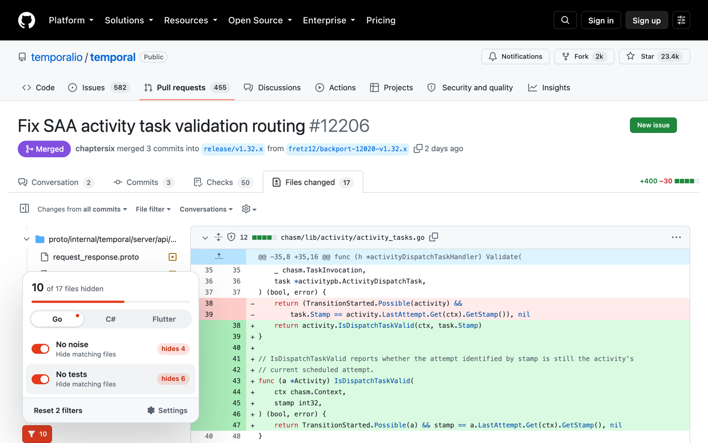
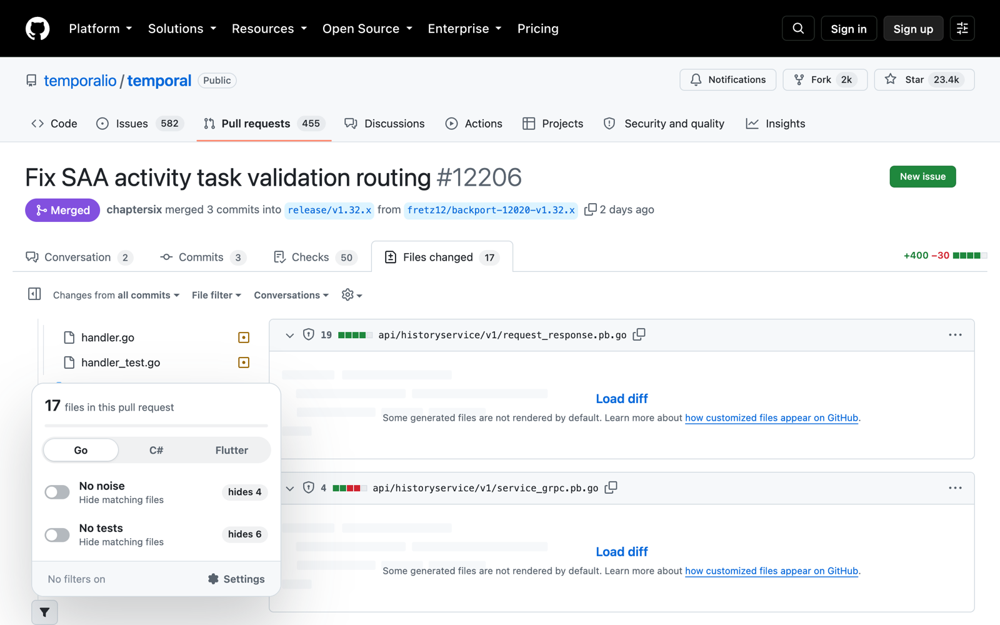
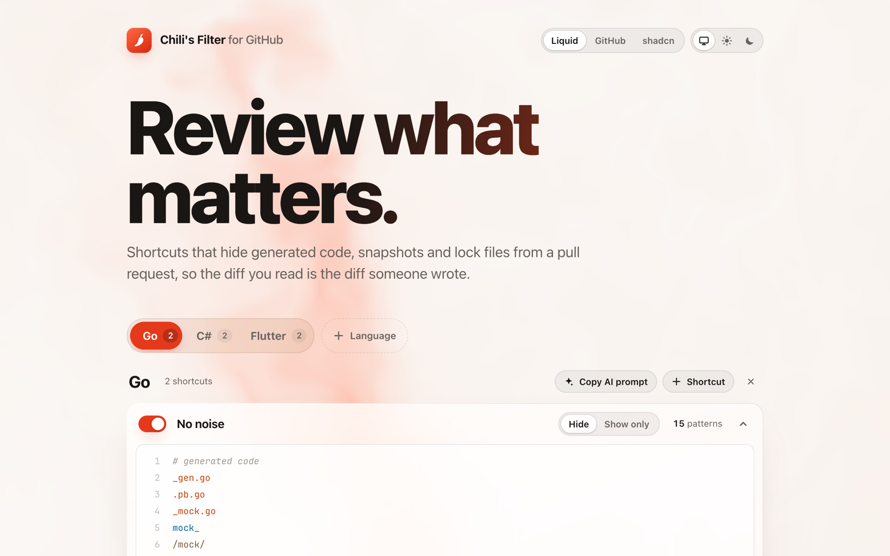

# Chili's Filter for GitHub

A Chrome extension that hides the files nobody needs to read in a pull request (generated code, lock files, snapshots, test fixtures and images), so you review only the code a person wrote.

## What it does

- Adds a filter button next to "Filter files…" on a pull request's Files changed page.
- Each shortcut is a switch that hides matching files from the diff and the file tree. The popup shows how many files each one hides in the pull request you are looking at.
- Shortcuts are grouped by language. Go, C# and Flutter come built in, and you can add your own.
- The settings page has a pattern editor with syntax highlighting, and a "Copy AI prompt" button that asks your AI assistant to suggest filters for your repository.
- Three themes (Liquid, GitHub, shadcn), each in light and dark, or following your system.

<table>
<tr>
<td></td>
<td></td>
</tr>
<tr>
<td align="center">Each shortcut shows how many files it would hide</td>
<td align="center">Settings: languages, shortcuts and themes</td>
</tr>
</table>

## Pattern syntax

One pattern per line:

| Pattern | Matches |
| --- | --- |
| `.go`, `_test.go` | the end of the file name |
| `mock_` | the start of the file name |
| `vendor/` | a folder anywhere in the path |
| `*.pb.go`, `api/**/*.json` | globs: `*` stays inside one folder, `**` crosses folders |
| `# note` | a comment, ignored |

A "Hide" shortcut hides matching files. A "Show only" shortcut hides everything else. Hide always wins.

## Install

**From a release:** download the latest zip from [Releases](../../releases), unzip it, then follow the steps below and select the unzipped folder.

**From source:**

1. Open `chrome://extensions` and turn on Developer mode.
2. Click **Load unpacked** and select this folder.
3. Open any pull request's Files changed tab.

## Releasing

1. Set the new `version` in `manifest.json` and commit.
2. Tag and push: `git tag v1.0.1 && git push origin master v1.0.1`.
3. GitHub Actions builds the zip and attaches it to a new release. Upload that zip in the Chrome Web Store dashboard.

## Privacy

Everything runs in your browser. The extension reads file names on github.com pages and stores your shortcuts in Chrome sync storage. It sends nothing anywhere.

## License

[WTFPL](LICENSE): do whatever you want with it.
